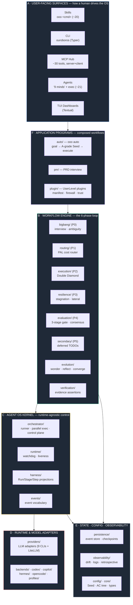

# Ouroboros — Architecture-to-Value Map

| | |
|---|---|
| **Status** | Draft for review |
| **Date** | 2026-06-11 |
| **Author** | deepak |
| **Type** | Schematic map / module catalog (no code in scope) |
| **Audience** | **Product Manager** (no code-reading required) |
| **Deliverable** | A complete, PM-readable map of every module/sub-module, what it does, the configurations that govern it (and what each enables), ending in **Top 5 areas of investment** |
| **Companion to** | [`improvement-themes.md`](./improvement-themes.md), which deliberately deferred this "architecture-to-value mapping." This document fills that gap. |
| **Evidence base** | The code itself, [`docs/architecture.md`](./docs/architecture.md), [`docs/config-reference.md`](./docs/config-reference.md), and the field logs in [`usage-driven-feedback/`](./usage-driven-feedback/). |

---

## 1. What Ouroboros is, in one paragraph

Ouroboros is an **"Agent OS"** — a local-first control layer that sits *between*
a human and any AI coding CLI (Claude Code, Codex, Gemini, Copilot, and five
others). Instead of letting you prompt an agent directly and hope, it forces a
disciplined loop: **interview the human until the goal is unambiguous → freeze
that into an immutable spec ("Seed") → execute it → verify it automatically →
feed what was learned back into the next attempt.** Every action is recorded as
a replayable event, so a run can be paused, resumed, audited, or reconstructed
even across machine restarts. The promise to the user: *fewer wrong builds,
because the wrong assumptions surface in a 5-minute interview instead of in a
PR review three days later.*

**The product is split across three repositories** (this map covers the third):

| Layer | Repo | Plain-English role |
|---|---|---|
| **Shell** | `Q00/ourocode` | The terminal cockpit a human sits in front of. |
| **Apps** | `Q00/ouroboros-plugins` | Installable domain workflows (PR ops, Jira sync, …). |
| **OS (this repo)** | `Q00/ouroboros` | The engine: spec contract, execution, evaluation, ledger, multi-runtime adapters. |

**Scale of this repo:** ~180K lines of Python across ~35 modules, plus a Rust
terminal UI. The three heaviest modules — **orchestrator** (~38K), **mcp**
(~28K), and **auto** (~18K) — are where most of the product's hard engineering
lives.

---

## 2. How to read this map

The system is organized as six concentric responsibilities. The rest of this
document walks each one. For every module you get: **Purpose** (what value it
delivers, functionally) and **Configuration** (the knobs that govern it and what
each knob actually changes for the user).

> **Reading the loop:** A user enters through **A** (a `ooo` command). Simple
> commands run a single phase of **B**; `ooo auto`/`ooo ralph` (**F**) drive the
> whole loop. Every phase executes through the **C** kernel, which talks to the
> chosen AI CLI via **D**, and records everything into **E**.

---

## 3. Part A — User-facing surfaces

*How a human (or an AI agent acting for them) actually invokes the system.*

### A1 · Skills — `ooo <cmd>` ( `skills/` )
**Purpose.** The primary front door. ~20 skills (`interview`, `seed`, `run`,
`auto`, `evaluate`, `evolve`, `unstuck`, `status`, `qa`, `pm`, `ralph`,
`brownfield`, `publish`, `resume-session`, `setup`, `tutorial`, `welcome`,
`cancel`, `update`, `help`). Each is a small instruction file that the host AI
reads and follows; most delegate to an MCP tool. This is what makes "type `ooo
interview` inside Claude Code" work.
**Configuration.** Skills are declarative (YAML front-matter naming the MCP tool
and arguments). No runtime config; behaviour is governed by the tool they call.

### A2 · CLI — `ouroboros` ( `cli/`, ~16K )
**Purpose.** The terminal-native equivalent for users not inside an AI session.
Command groups: `init` (interview/seed), `run`, `job`, `status`, `cancel`,
`config`, `setup`, `detect`, `mcp` (+`mcp-doctor`), `tui`, `pm`, `qa`, `plugin`,
`resume`, `uninstall`, `workflow-ir`, `auto`. Also owns first-run onboarding and
diagnostics.
**Configuration.** Reads the entire `~/.ouroboros/config.yaml`; `ouroboros config
init` generates defaults. Most subcommands accept flags that shadow config keys
for a single invocation.

### A3 · MCP Hub ( `mcp/`, ~28K )
**Purpose.** The real engine API, exposed two ways at once:
- **Server mode** — publishes ~30 tools (`ouroboros_interview`,
  `ouroboros_generate_seed`, `ouroboros_execute_seed`, `ouroboros_evaluate`,
  `ouroboros_evolve_step`, `ouroboros_auto`, `ouroboros_qa`,
  `ouroboros_job_*`, `ouroboros_query_events`, …) to Claude Desktop / any MCP
  client. The `*_start_*` variants launch long jobs in the background and return
  a `job_id` so the host doesn't time out.
- **Client mode** — *consumes* external MCP servers (filesystem, GitHub, web
  search) and merges their tools into a run.
- **Job manager** — tracks background jobs, their status, and (critically)
  **reconciles "zombie" jobs** whose owning process died.
**Configuration.** `runtime_controls.*` (tool timeouts, watchdog poll);
`OUROBOROS_WEB_SEARCH_TOOL` (names an MCP search tool to augment interviews);
MCP client servers are declared in an `mcp.yaml`/host MCP config. Built-in tools
win over external ones on name clash.

### A4 · Agents — "The Nine Minds" + executors ( `src/ouroboros/agents/`, ~21 files )
**Purpose.** Persona prompt-packs loaded on demand. Nine "thinking modes"
(Socratic Interviewer, Ontologist, Seed Architect, Evaluator, Contrarian,
Hacker, Simplifier, Researcher, Architect) plus execution/evaluation specialists
(code-executor, codebase-explorer, semantic-evaluator, consensus-reviewer,
advocate/devil/judge, qa-judge, seed-closer, breadth-keeper). Each is a
different "mode of thought" the engine can switch into.
**Configuration.** `OUROBOROS_AGENTS_DIR` points to a custom prompt directory to
override the bundled personas without reinstalling.

### A5 · TUI Dashboards ( `tui/`, ~11.5K + Rust crate )
**Purpose.** Live visibility while a run executes: AC tree with progress, agent
activity monitor, drift meter, cost/token trackers, lineage tree, event log.
Three dashboard generations ship (`dashboard`, `_v2`, `_v3`/`hud_dashboard`).
This is the main answer today to "what is happening right now?"
**Configuration.** `ouroboros tui` flags; reads the event store (DB path defaults
to `~/.ouroboros/ouroboros.db`). Largely self-configuring.

---

## 4. Part B — The Workflow Engine (the six phases)

*This is the conceptual heart: the loop the README draws as a serpent eating its
tail. Each phase is a module, each has its own config section.*

### B0 · Big Bang — Interview & Seed ( `bigbang/` )
**Purpose.** Turns a vague sentence into a crystallized, unambiguous spec.
Conducts a Socratic interview, scores **ambiguity** after each answer, and
**auto-generates the Seed** once the goal is clear enough. Also includes the
**brownfield explorer** that reads an existing repo so the interview is grounded
in real code.
**Gate.** Ambiguity ≤ 0.2 (weighted: goal 40% · constraints 30% · success 30%;
brownfield adds context 15%).
**Configuration — `clarification`:**
| Key | Default | What it changes for the user |
|---|---|---|
| `ambiguity_threshold` | `0.2` | How clear the goal must be before code starts. Lower = stricter, more questions. |
| `max_interview_rounds` | `10` | Hard cap on questions, so the interview can't loop forever. |
| `model_tier` / `default_model` | `standard` / `claude-opus-4-6` | Which model conducts the interview (quality vs cost). |

### Core · The Seed & AC Tree ( `core/` )
**Purpose.** The data "constitution" of every run. The **Seed** is an immutable
spec (goal, constraints, acceptance criteria, ontology, exit conditions). The
**Acceptance-Criteria Tree** recursively decomposes the goal into checkable
units. Also home to shared types (the `Result` success/error type), the error
hierarchy, ontology schema, and **security limits** (input-size caps that prevent
denial-of-service via huge inputs).
**Configuration.** Security caps are constants (e.g. 50K-char interview input,
1MB seed file). The Seed is intentionally *not* user-configurable once frozen —
immutability is the feature.

### B1 · PAL Router — cost optimization ( `routing/` )
**Purpose.** Picks the cheapest model that can plausibly do each task, then
**escalates only on failure** and **downgrades after sustained success.** This
is the system's frugality engine: start at 1× cost, move to 10×, then 30× only
when the work proves hard.
**Configuration — `economics`:**
| Key | Default | What it changes |
|---|---|---|
| `default_tier` | `frugal` | Where every task starts (frugal 1× / standard 10× / frontier 30×). |
| `escalation_threshold` | `2` | Failures before paying for a smarter model. |
| `downgrade_success_streak` | `5` | Successes before dropping back to cheaper models. |
| `tiers` | (3 tiers) | The model roster and relative cost per tier — the core cost-vs-capability dial. |

### B2 · Double Diamond — execution ( `execution/` )
**Purpose.** The build phase. Each acceptance criterion runs through
Discover → Define → Design → Deliver. Non-atomic criteria are **decomposed**
into 2–5 children (recursion capped at depth 5) and executed in parallel where
dependencies allow. **Atomicity detection** decides when a task is small enough
to just build.
**Configuration — `execution`:**
| Key | Default | What it changes |
|---|---|---|
| `max_iterations_per_ac` | `10` | How many attempts a single criterion gets before escalation/failure. |
| `retrospective_interval` | `3` | How often the system pauses to self-check for drift. |
| `atomicity_model` / `decomposition_model` / `double_diamond_model` | `claude-opus-4-6` | Models for the "how should I break this down?" decisions. |
| `orchestrator.max_parallel_workers` | `3` | How many criteria build at once (see kernel note — capped to backend limits). |

### B3 · Resilience — stagnation & lateral thinking ( `resilience/` )
**Purpose.** Detects when a run is stuck and changes *perspective* rather than
trying harder. Recognizes 4 failure patterns (SPINNING, OSCILLATION, NO_DRIFT,
DIMINISHING_RETURNS) and rotates in 5 lateral-thinking personas (Hacker,
Researcher, Simplifier, Architect, Contrarian), each matched to the pattern it
best breaks.
**Configuration — `resilience`:**
| Key | Default | What it changes |
|---|---|---|
| `stagnation_enabled` | `true` | Whether the system watches for "stuck" patterns at all. |
| `lateral_thinking_enabled` | `true` | Whether it injects a fresh perspective when stuck. |
| `lateral_model_tier` / `lateral_temperature` | `frontier` / `0.8` | How capable and how "creative/divergent" the unsticking is. |
| `wonder_model` / `reflect_model` | `claude-opus-4-6` | Models for the evolutionary divergence/convergence steps. |

### B4 · Evaluation — the 3-stage gate ( `evaluation/` )
**Purpose.** Replaces "looks good to me" with progressive, cost-aware
verification: **Stage 1 Mechanical ($0)** — lint/build/test/coverage,
auto-detecting the project language; **Stage 2 Semantic ($$)** — does the output
actually satisfy the criteria and stay on-goal; **Stage 3 Consensus ($$$)** —
multiple models vote, but *only* when one of six risk triggers fires (e.g. seed
drift > 0.3, high uncertainty). Cheap checks first; expensive consensus only at
genuine risk gates.
**Configuration — `evaluation`:**
| Key | Default | What it changes |
|---|---|---|
| `stage1/2/3_enabled` | `true` | Toggle each verification stage. |
| `satisfaction_threshold` | `0.8` | Bar to pass semantic review without escalating. |
| `uncertainty_threshold` | `0.3` | Doubt level that forces a multi-model vote. |
| `semantic_model` / `assertion_extraction_model` | opus / sonnet | Models doing the judging. |
| Project override | `.ouroboros/mechanical.toml` | Lets a repo define its own build/test commands (allowlist-validated for safety). |

### B5 · Consensus — multi-model voting ( `evaluation/consensus`, `strategies/` )
**Purpose.** The highest-assurance gate. Either **simple voting** (3 diverse
models, 2/3 majority) or **deliberative** mode (Advocate vs Devil's Advocate,
with a Judge). Used for irreversible/structural decisions like changing a frozen
Seed.
**Configuration — `consensus`:**
| Key | Default | What it changes |
|---|---|---|
| `min_models` / `threshold` | `3` / `0.67` | How many votes and what majority is needed. |
| `diversity_required` | `true` | Forces voters from different providers (guards groupthink). |
| `models` / `advocate_model` / `devil_model` / `judge_model` | (rosters) | The exact jury, per backend. |

### B6 · Secondary Loop — deferred work ( `secondary/` )
**Purpose.** Keeps the run focused on the primary goal by parking non-blocking
TODOs in a registry and batch-processing them later. Prevents scope creep mid-build.
**Configuration.** Behavioural; no dedicated config section.

### B7 · Evolution — the loop that learns ( `evolution/` )
**Purpose.** What makes the serpent *evolve* rather than repeat. **Wonder** asks
"what do we still not know?", **Reflect** folds the answer into the next Seed,
and **convergence** detection stops the loop when consecutive generations are
ontologically identical (similarity ≥ 0.95, or a 30-generation safety cap).
Includes **regression** and **material-progress** guards so a "new generation"
that didn't actually advance is caught.
**Configuration.** `resilience.wonder_model`/`reflect_model`; the MCP-evolution
env vars (`OUROBOROS_EVOLVE_STAGE1`, execution/validation models);
`runtime_controls.*` timeouts bound each generation.

### B8 · Verification — evidence ( `verification/` )
**Purpose.** Extracts concrete, checkable assertions from seed criteria and
verifies them against real evidence, so "done" is backed by artifacts, not a
model's say-so. Feeds the Deliver gate in the harness.
**Configuration.** Uses evaluation/assertion models; evidence policy documented
in `docs/contributing/verifier-evidence-policy.md`.

---

## 5. Part C — The Agent OS Kernel

*Runtime-agnostic control. This is the "OS" in Agent OS: it owns the contract
that every run obeys regardless of which AI CLI executes the work. The
vocabulary here is intentionally locked (see
[`agent-os-kernel-terminology.md`](./docs/contributing/agent-os-kernel-terminology.md)).*

### C1 · Orchestrator ( `orchestrator/`, ~38K — the single largest module )
**Purpose.** The kernel. Key responsibilities, in PM terms:
- **Runtime abstraction** (`adapter.py`, `runtime_factory.py`) — one `AgentRuntime`
  contract that all 9 AI CLIs satisfy, so the rest of the engine never knows
  which tool is executing.
- **Execution** (`runner.py`, `parallel_executor.py`, `coordinator.py`) — drives
  the phases, fans work out to parallel workers, collects results.
- **Control plane** (`control_plane.py`, `control_bus.py`, `policy.py`) — the
  "syscall layer": emits a small stable alphabet of directives (CONTINUE, RETRY,
  WAIT, CANCEL, CONVERGE) and enforces invariants (terminal means terminal;
  resume preserves the original envelope).
- **Liveness & governance** (`heartbeat.py`, `rate_limit.py`, `backend_limits.py`,
  `runtime_error.py`, `failure_taxonomy.py`) — PID-lock heartbeats so dead jobs
  are detectable; a shared rate-limit bucket; a typed error taxonomy.
- **Workflow IR & evidence** (`workflow_ir.py`, `traceguard_*`, `baseline_metrics_*`)
  — a portable description of a workflow and a "black box" of what really happened.
**Configuration — `orchestrator` + `runtime_controls`:**
| Key | Default | What it changes |
|---|---|---|
| `runtime_backend` | `claude` | Which AI CLI executes the work (claude/codex/opencode/hermes/gemini/kiro/copilot/pi). |
| `permission_mode` | `acceptEdits` | How much the agent can do without asking. **Headless runs need `bypassPermissions`** or they freeze on prompts. |
| `max_parallel_workers` | `3` | Requested concurrency — **but effective fan-out is capped to the backend's known safe limit** (unknown-limit CLIs serialize to 1 unless `OUROBOROS_MAX_CONCURRENCY` raises it). |
| `default_max_turns` | `10` | Agent turn budget per task. |
| `*_cli_path` | `null` | Explicit binary paths when a CLI isn't on `PATH`. |
| `runtime_controls.generation_idle/no_progress/safety_timeout_seconds` | 2h / 4h / off | Bounds on silent hangs vs. busy-but-not-progressing vs. an absolute ceiling. |

### C2 · Runtime controls — watchdog ( `runtime/` )
**Purpose.** The liveness referee for long jobs. Distinguishes *idle* (no
activity) from *no material progress* (busy but not advancing a real milestone),
and can hard-stop after a safety timeout. This is what keeps multi-hour
autonomous runs from hanging forever or burning budget in circles.
**Configuration.** `runtime_controls.*` (above) and the matching
`OUROBOROS_GENERATION_*` env vars.

### C3 · Harness — the public read-model ( `harness/` )
**Purpose.** A stable, schema-versioned projection of "what a run did" —
**Run / Stage / Step / Artifact / Verdict** records built from the event store,
plus an **evidence manifest** and a **Deliver gate** that checks a claim of
"done" against journaled evidence (with a "claim-term guard" that blocks
overstated completion claims). This is the surface plugins and dashboards read
instead of reinventing status formats.
**Configuration.** Read-only over the event store; no user knobs.

### C4 · Events — the vocabulary ( `events/` )
**Purpose.** Defines the immutable event types (control, decomposition,
evaluation, interview, lineage, ontology, human-in-the-loop, I/O). Everything
that happens is one of these, in past tense — the alphabet of the audit trail.
**Configuration.** None; it *is* the schema.

---

## 6. Part D — Runtime & Model Adapters

*The pluggable "device drivers." Same workflow spec, many execution engines.*

### D1 · Providers — LLM adapters ( `providers/`, ~8.9K )
**Purpose.** One normalized interface over every model source: LiteLLM (100+
models), Anthropic, Claude Code, Codex CLI, Copilot CLI, Gemini CLI, Goose CLI,
Hermes CLI, Kiro, OpenCode, and a Pi LLM adapter. Handles streaming, retries,
and per-provider quirks. **This is the layer the field logs flagged as brittle**
(e.g. blindly forwarding `response_format` to a provider that rejects it).
**Configuration — `llm` + `llm_profiles`/`llm_role_profiles`:**
| Key | Default | What it changes |
|---|---|---|
| `llm.backend` | `claude_code` | Model source for non-agent flows (interview, QA, analysis). |
| `llm.qa_model` / `dependency_analysis_model` / `ontology_analysis_model` / `context_compression_model` | (per role) | Per-task model picks for internal reasoning steps. |
| `llm_profiles` + `llm_role_profiles` | (portable) | Provider-neutral task profiles mapped to logical roles — the portable way to retune cost/quality across many tasks at once. |

### D2 · Backend capabilities & runtime profiles ( `backends/`, `codex/`, `copilot/`, `hermes/`, `opencode/`, `profiles/` )
**Purpose.** Per-runtime knowledge: what a backend can do (`backends/capabilities`),
CLI policies, model discovery (Copilot live-queries GitHub's model API), artifact
handling, and **execution profile YAMLs** (`analysis`/`code`/`research`) that
preset turn budgets and sampling for whole classes of work.
**Configuration.** Profile YAMLs ship with the package; Codex profiles map to
`codex exec --profile`; `ouroboros setup --runtime <x>` writes the right
per-runtime anchors.

### D3 · Skill-dispatch router ( `router/` )
**Purpose.** Parses raw `ooo …` input and routes it to the right skill/MCP tool —
the small but critical glue that makes the `ooo` prefix feel native inside any host.
**Configuration.** Command grammar is internal.

---

## 7. Part E — State, Config & Observability

### E1 · Persistence — event sourcing ( `persistence/` )
**Purpose.** The system's memory and its time machine. A single append-only
SQLite `events` table (5 indexes) records every state change; checkpoints enable
3-level rollback and 5-minute periodic snapshots. This is what makes pause,
resume, audit, and "pick up after a restart" possible.
**Configuration — `persistence`:** `enabled` (default `true`); `database_path`
(*currently reserved* — the store uses a hardcoded `~/.ouroboros/ouroboros.db`).

### E2 · Observability — drift, logs, retrospective ( `observability/` )
**Purpose.** **Drift** measures how far a run has strayed from its Seed (goal 50%
+ constraint 30% + ontology 20%); crossing thresholds triggers a warning or a
re-alignment. **Retrospective** auto-summarizes what happened. **Logging** is
structured.
**Configuration — `drift` + `logging`:**
| Key | Default | What it changes |
|---|---|---|
| `drift.warning_threshold` / `critical_threshold` | `0.3` / `0.5` | When the system warns vs. actively re-aligns. |
| `logging.level` / `log_path` / `include_reasoning` | `info` / … / `true` | Verbosity and whether model reasoning is logged. |
| `OUROBOROS_LOG_MODE` | `dev` | Human-readable vs. JSON logs. |

### E3 · Config ( `config/` )
**Purpose.** The single loader/validator for `~/.ouroboros/config.yaml`,
credentials, and ~50 environment overrides (env always wins). Defines the 13
config sections this document references.
**Configuration.** *It is the configuration system.* Note the documented quirk
(see Top-5 #3): some values are read live from disk, others are bound when the
adapter is constructed — so some edits apply instantly and some need an `/mcp`
reconnect, with no signal which is which.

---

## 8. Part F — Application Programs (UserLevel)

*Composed workflows built on the primitives above. These are the "killer apps."*

### F1 · `auto/` — the flagship autonomous flow ( ~18K )
**Purpose.** `ooo auto "<one-line goal>"` runs the **entire loop unattended**:
goal → interview → A-grade Seed → execution handoff, with bounded, resumable
state. Notable design choices that directly serve users:
- A **deterministic answerer** plays the human in the interview using only
  repo facts, conventions, and conservative defaults — every answer is
  **source-tagged** (`[user_goal]`, `[repo_fact]`, `[assumption]`, …) so the
  provenance of each decision is auditable.
- A **grade gate** won't proceed until the Seed reaches an A-grade floor; a
  **seed-repairer/reviewer** fixes weak specs automatically.
- Fully **resumable** state machine (`CREATED → INTERVIEW → SEED_GENERATION →
  REVIEW ⇄ REPAIR → RUN → COMPLETE`, with `BLOCKED`/`FAILED`), persisted to disk
  and resumable by `auto_session_id`.
- **Worktree isolation, checkpoint commits, blocker attribution, recovery plans.**
**Configuration.** `max_interview_rounds`, `max_repair_rounds`, `skip_run`,
`complete_product`, `pipeline_timeout_seconds` (skill args); inherits all engine
config below it.

### F2 · `pm/` — PRD generation
**Purpose.** A PM-oriented interview that produces a structured PRD/handoff
document rather than going straight to code — the bridge between product intent
and the Seed.
**Configuration.** `pm_interview` / `pm_document` roles in `llm_role_profiles`.

### F3 · `plugin/` — UserLevel plugin system ( ~9.5K )
**Purpose.** The contract that lets third-party domain workflows (PR ops, Jira
sync, incident response) install against the kernel **safely**: a declared
**manifest** with scoped permissions, a **firewall** and **trust store** for
capability enforcement, a **lockfile** for reproducibility, **hooks** for
lifecycle events, and an audit **ledger adapter**. (The third-party *install*
surface, `ooo plugin add`, is architecturally specified but not yet on `main`;
first-party `auto`/`run`/`pm` already use this contract.)
**Configuration.** Per-plugin manifest (scopes, hooks); trust decisions are
persisted.

---

## 9. Configuration Atlas (one-screen index)

All 13 sections of `~/.ouroboros/config.yaml`, what each governs, and the module
it lands in. Full detail: [`config-reference.md`](./docs/config-reference.md).

| Section | Governs | Lands in | Highest-leverage knob |
|---|---|---|---|
| `orchestrator` | Which AI CLI runs work, permissions, concurrency | C1 Kernel | `runtime_backend`, `permission_mode` |
| `llm` | Models for internal reasoning (non-agent) | D1 Providers | `backend`, per-role `*_model` |
| `economics` | Cost-tier routing | B1 PAL Router | `default_tier`, `tiers` |
| `clarification` | Interview rigor | B0 Big Bang | `ambiguity_threshold` |
| `execution` | Build loop depth & retries | B2 Double Diamond | `max_iterations_per_ac` |
| `resilience` | Unsticking behaviour | B3 Resilience | `lateral_thinking_enabled` |
| `evaluation` | Verification stages | B4 Evaluation | `satisfaction_threshold` |
| `consensus` | Multi-model jury | B5 Consensus | `min_models`, `models` |
| `llm_profiles` / `llm_role_profiles` | Portable task tuning | D1 Providers | role→profile map |
| `persistence` | Event store | E1 Persistence | `enabled` |
| `drift` | Goal-adherence alarms | E2 Observability | `critical_threshold` |
| `runtime_controls` | Long-run liveness | C2 Runtime | `generation_no_progress_timeout_seconds` |
| `logging` | Log verbosity/format | E2 Observability | `level` |
| + `credentials.yaml` / `ANTHROPIC_API_KEY` etc. | Provider keys | D1 Providers | (secrets — env wins) |

---

## 10. Cross-cutting value themes (what the map reveals)

Reading the architecture against the field logs in
[`usage-driven-feedback/`](./usage-driven-feedback/) and the memory note that
*"layperson users get lost; no workflow visibility or progress tracking,"* five
value themes recur. They set up the investment recommendations.

1. **Reliability of the runtime/provider boundary** is the difference between
   "magic" and "wasted an afternoon." The worst logged failure killed all 14
   acceptance criteria with *zero tokens consumed* because a typed 429 was
   flattened to free text at a subprocess boundary.
2. **Transparency** — the system is a "black box" to users at three levels:
   *journey* (what's happening / what's next / how far), *methodology* (is this
   frugal? how automated?), and *configuration* (what knobs exist and their
   defaults).
3. **Frugality as a visible, learned property** — the cost machinery (PAL router,
   drift, stagnation) exists but *waste* isn't surfaced or learned as reusable
   guardrails.
4. **Automation depth** — `ooo auto`/`ralph` are powerful but their robustness
   across restarts, resume, and handoff is where trust is won or lost.
5. **Onboarding friction** — Python pinning, MCP registration, restart-to-apply,
   and permission-mode traps each block a first run before any value is felt.

---

## 11. Top 5 Areas of Investment

> Prioritized for **value unlocked per unit of effort/risk**, consistent with the
> *baby-steps-over-big-bang* and *waste-only frugality* principles, and weighted
> toward the documented primary persona (the **non-technical first-timer**). Each
> names where it lives, the evidence, and a low-risk **first move**.
>
> 📋 **Each area now has a dedicated strategy + plan document** (problem, current
> code state, target, phased baby-steps plan, metrics, risks) in
> [`investment-plans/`](./investment-plans/README.md). That set is **six** plans:
> the five below — with the frugality plan (#4) expanded into a single workstream
> that absorbs the [complexity→investment spend mechanism (#1384)](./investment-plans/04-frugality-and-spend-decision.md)
> raised in discussion — plus a sixth on
> [atomicity / decomposition reliability (#1385)](./investment-plans/06-atomicity-decomposition-reliability.md),
> which together fund the frugality and reliability promises the top-5 depend on.
>
> ✅ **Owner greenlight (2026-06-11).** The owner accepted all four discussions and
> applied two reshapes the plans now carry as the source of truth: (1) the #1384 spend
> actuator is a **reasoning-effort dial, not tier/model switching** — the unwired
> `PALRouter` is **removed, not wired**; (2) the #1385 analysis is **re-grounded on
> `orchestrator/parallel_executor.py`**, because the dissected `execution/` modules
> (Double Diamond, `atomicity.py`, `decomposition.py`) turned out to have **no live
> caller**. The first usability slice is already merged as RFC [#1392](https://github.com/Q00/ouroboros/pull/1392).
> See each plan's *Owner direction* section.

### Investment #1 — Finish the typed runtime/provider reliability contract
**The opportunity.** Make "your run dies instantly for an opaque reason"
impossible. Three linked gaps: (a) **parameter-level capability negotiation** so
a provider that can't accept `response_format` gets it dropped, not a hard
failure; (b) **provider-aware quota tracking + a pre-flight probe** so a
5-hour-quota-exhausted backend is detected *before* fan-out instead of
stampeding; (c) **fallback providers** so one backend's 429 doesn't take down the
whole run.
**Value to users.** Removes the single most destructive, trust-eroding failure
class. Directly converts "I gave up" into "it just worked."
**Where it lives.** D1 `providers/` (capability table, `litellm_adapter`),
C1 `orchestrator/` (`rate_limit`, `backend_limits`, `runtime_error`).
**Evidence.** `usage-issues.md` §1.1–1.6; `rca-and-remediation-plan.md` R1, R3, R4.
**Already in flight (important).** The current branch and recent commits already
landed **typed hermes error metadata** (`d842be3b`), **backend-aware delivery
fan-out caps** (`916b92e8`), and **zombie-job reconciliation** (`f1e36f30`,
`ea8aaa44`). So R4/S and part of R3 are *underway* — this investment is about
**completing the set**: the parameter-capability table (R1) and the
long-horizon quota probe + fallbacks remain open.
**Effort/Risk.** Medium effort, low risk (contracts + a lookup table; mostly
additive). **First move:** add a per-provider capability descriptor and route
`response_format` through it — closes the §1.2 class in one change.

### Investment #2 — De-blackbox the journey (progress & "what happens next")
**The opportunity.** A single, always-available answer to *"what is happening
now, what comes next, and how far along am I?"* — surfaced in the MCP/job layer
and elevated through the existing TUI, not just buried in logs. The Run/Stage/
Step **harness projections already exist** (C3); this is largely *exposing* a
read-model that's already built.
**Value to users.** This is the #1 adoption/retention lever for the primary
persona. The memory note ("layperson users get lost; no progress tracking") and
the themes doc both name *journey opacity* as the acute pain.
**Where it lives.** A3 `mcp/` (progress in `job_*` tools), C3 `harness/`
(projections), A5 `tui/`.
**Evidence.** `improvement-themes.md` §1 (journey opacity); memory
*"Ouroboros UX friction."*
**Effort/Risk.** Low–medium effort, low risk (read-only projection already
exists). **First move:** have `ouroboros_job_status` return a structured
`{phase, step, ac_done/ac_total, next_action}` from the harness projection so
every host gets a progress line for free.

### Investment #3 — Coherent configuration: surface it, and make reload honest
**The opportunity.** Two halves: (a) **proactively surface the relevant configs
and their defaults** at setup and whenever they change — for Ouroboros *and* the
underlying runtime; (b) end the *"I fixed it but it's still broken"* trap by
either rebuilding config-bound objects on change or **detecting a stale
structural edit and telling the user a reconnect is required.**
**Value to users.** Kills an entire recurring confusion loop and the
config-opacity theme. Especially valuable for first-timers who can't know which
of 50 env vars matters.
**Where it lives.** E3 `config/`, C1 `orchestrator/` (adapter binding), A2/A3
setup + MCP.
**Evidence.** `usage-issues.md` §2.4–2.6, §5; `rca-and-remediation-plan.md` R2/R5;
`improvement-themes.md` §1 (configuration opacity).
**Effort/Risk.** Low effort for the *detect-and-warn* half (high value), higher
for full live-reload. **First move:** on MCP reconnect, diff the on-disk config
against the bound values and warn on any structural drift — never let a no-op
edit pass silently.

### Investment #4 — Frugality you can see and that compounds
**The opportunity.** Make *wasted* tokens (motion that didn't advance a verified
acceptance criterion) **visible per run** and **learned as reusable guardrails**
over time — explicitly *floor-preserving* (never cap the comprehensiveness the
user is paying for). The raw signals already exist (drift, stagnation patterns,
tier history, the IO journal); the gap is surfacing and accumulating them.
**Value to users.** A credible, differentiated answer to "is this being
economical with my money/tokens?" — without the crude blunt instrument of a
budget cap. Aligns with the frugality memory (*"could this be cheaper? → codify a
generalizable guardrail"*).
**Where it lives.** E2 `observability/` (drift, retrospective), B1 `routing/`
(tier history), C3 `harness/` (evidence/journal).
**Evidence.** `improvement-themes.md` §1 (methodology opacity / frugality, Stage E);
memory *"frugality-reflective-guardrails."*
**Effort/Risk.** Medium effort, low risk (analytics over existing events).
**First move:** a per-run "waste retrospective" — count iterations/tokens spent
on ACs that later failed or were re-done, and show it in the run summary.

### Investment #5 — Make autonomous runs trustworthy end-to-end
**The opportunity.** Harden the flagship `auto`/`ralph` loops so unattended,
multi-hour, cross-restart runs are dependable: authoritative job reconciliation
(no zombies), transparent resume state, and a robust handoff contract. This is
the "set it and forget it" promise that justifies the whole spec-first ceremony.
**Value to users.** Converts `ooo auto` from "impressive demo" into "I trust it
overnight." High strategic value — it's the product's marquee differentiator.
**Where it lives.** F1 `auto/`, C1/C2 `orchestrator/` + `runtime/` (heartbeat,
watchdog), A3 `mcp/` (job manager, resume).
**Evidence.** `usage-issues.md` §3.1, §3.5; `rca-and-remediation-plan.md` S;
auto's own resumable state machine design.
**Already in flight.** Zombie reconciliation is being addressed on this branch —
the remaining work is **resume-state transparency** (§3.5: "no in-flight
sessions to resume" was opaque) and surfacing reconciliation outcomes to the user.
**Effort/Risk.** Medium effort, medium risk (touches liveness + state). **First
move:** make `ooo resume-session` always report *why* there's nothing to resume
(completed/failed/cancelled/orphaned-and-reconciled), so resume state is never a
silent dead end.

---

### Priority at a glance

| # | Investment | Primary value | Effort | Risk | In flight? |
|---|---|---|---|---|---|
| 1 | Typed runtime/provider reliability | Stops catastrophic run-killers | Med | Low | **Partially** — finish R1 + quota probe |
| 2 | De-blackbox the journey | Adoption/retention (first-timers) | Low–Med | Low | No |
| 3 | Coherent config surfacing + reload | Ends "fixed-but-broken" loop | Low (warn) | Low | No |
| 4 | Visible, compounding frugality | Differentiated trust on cost | Med | Low | No |
| 5 | Trustworthy autonomous runs | Marquee `ooo auto` promise | Med | Med | **Partially** — zombies addressed |

> **Sequencing suggestion (baby-steps).** Ship the *first moves* of #2 and #3
> first — both are low-risk, read-only/detect-only, and immediately reduce the
> "black box" feeling for every user. Complete the in-flight #1/#5 hardening in
> parallel. Treat #4 as the fast-follow that turns frugality from a claim into a
> visible, accumulating feature.

---

## Appendix — sources & confidence

- **Architecture & configs:** read directly from `docs/architecture.md`,
  `docs/config-reference.md`, `docs/contributing/agent-os-kernel-terminology.md`,
  and the module sources under `src/ouroboros/`. High confidence.
- **User value / pain:** `usage-driven-feedback/usage-issues.md` and
  `rca-and-remediation-plan.md` (a field sweep + code-verified RCA), plus the
  project memory notes. High confidence on the *what*; the *prioritization* is a
  judgment call open to PM revision.
- **In-flight status:** inferred from the current branch
  (`feat/zombie-job-reconciliation`) and recent commits; confirm against open PRs
  before finalizing scope.
- **Counts** (~20 skills, ~21 agents, ~30 MCP tools, 9 runtime adapters, 13
  config sections) are point-in-time and will drift as the repo evolves.
